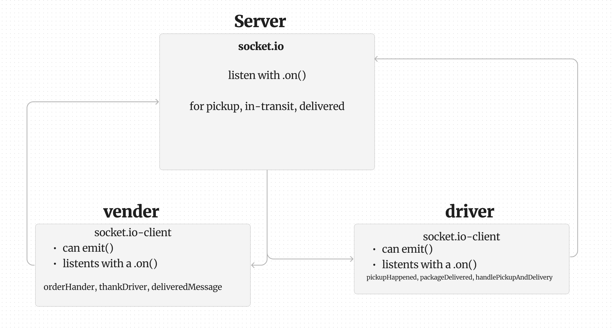
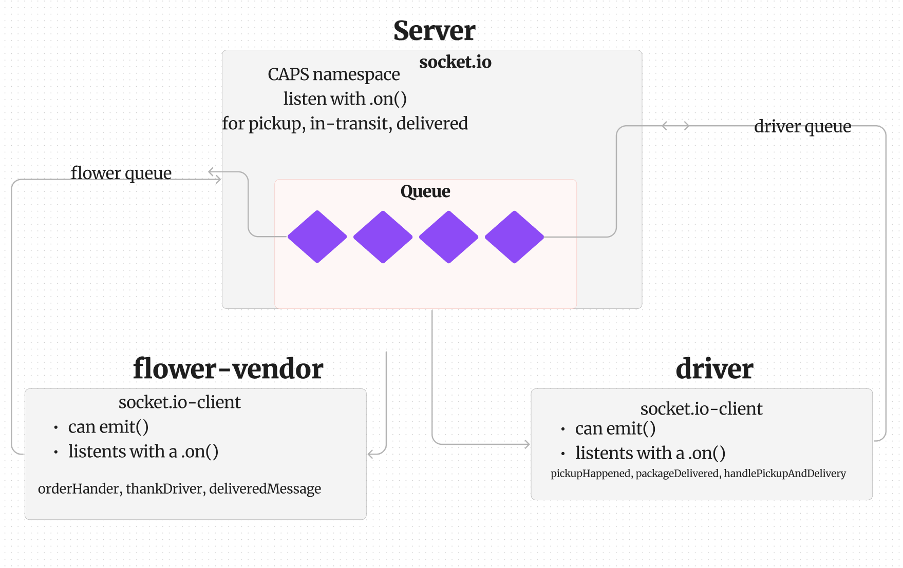

# caps

## LAB - Class 11

### Author: Coriana Wiiliams

### Problem Domain

CAPS Phase 1: Begin the build of an application for a product called CAPS

### Links and Resources

- [GitHub Actions ci/cd](https://github.com/Coriana1/caps/actions)

### Collaborators

Kenya Womack, class demo

I started the build out with what was given in class

I used the code from code review to build

### Setup

#### `.env` requirements (where applicable)

port variable exists within the env sample

#### How to initialize/run your application (where applicable)

clone repo, `npm i`, then run `nodemon` in the terminal

#### Routes

- GET : `/success` - specific route to hit

#### Tests

to run tests, after running `npm i`, run the command `npm test`

#### UML

